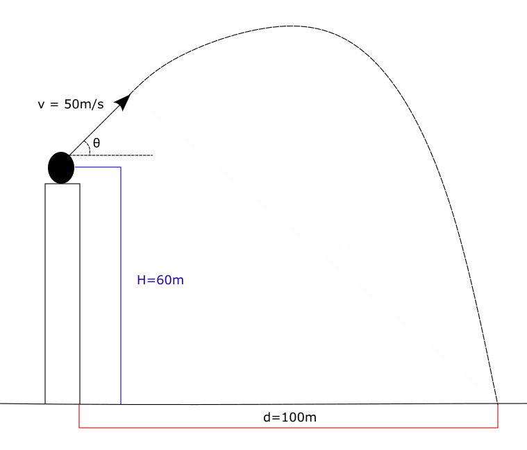
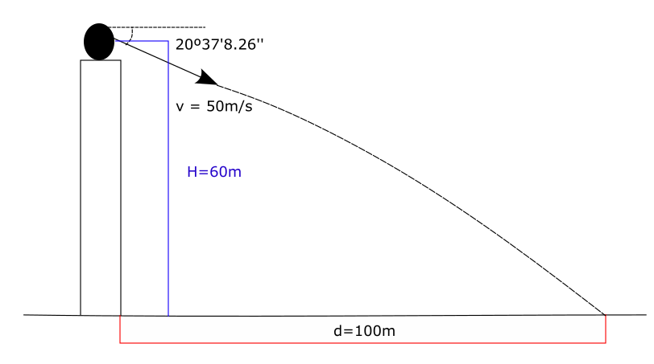

Vamos a poner un ejemplo de aplicación de los métodos que hemos visto hasta ahora. Tomemos un problema de proyectiles y trayectorias parábolicas:

**PREGUNTA**
 
Un proyectil es lanzado desde una altura de H=60m a una velocidad inicial de v=50m/s. El vector de velocidad forma un ángulo θ con respecto a la horizontal. Se busca que el proyectil tenga un alcance horizontal de d=100m. ¿A que ángulo θ con respecto a la horizontal debe ser lanzado? La aceleración de la gravedad es g=9.8 m/s^2.

 

De la física, sabemos que podemos descomponer el movimiento de una trayectoria bi-dimensional en sus dos componentes: su movimiento en un eje horizontal y su movimiento en un eje vertical. En el eje horizontal, el proyectil no experimenta aceleración, por lo que su ecuación de movimiento horizontal es a velocidad constante; la velocidad es la componente horizontal de la velocidad inicial:
$$x(t)=v_{x_0}t=v\cos(\theta)t$$
En su movimiento vertical, experimenta la aceleración de la gravedad, la cual es constante, por ende es un movimiento rectilineo uniformemente variado. La ecuación de movimiento vertical es:
$$y(t)=H+v_{y_0}t-\frac{1}{2}gt^2=H+v\sin(\theta)t-\frac{1}{2}gt^2$$
El tiempo para ambas ecuaciones es el mismo, por lo que podemos despejar el tiempo de la ecuación de movimiento horizontal para reemplazarlo en la segunda ecuación:
$$t=\frac{x(t)}{v\cos(\theta)}$$
$$y(t)=H+v\sin(\theta)\frac{x(t)}{v\cos(\theta)}-\frac{1}{2}g\frac{x(t)^2}{v^2\cos(\theta)^2}$$
Podemos prescindir ahora del paréntesis (t), pues la anterior expresión muestra la relación que existe entre la coordenada vertical y la coordenada horizontal del movimiento. Esta ecuación representa una trayectoria parabolica:
$$y=H+\tan(\theta)x-\frac{g}{2v^2\cos(\theta)^2}x^2$$
Cuando el proyectil alcanza su máxima distancia horizontal, significa que ya ha tocado el suelo y, por ende, y=0. Reemplazando los datos del problema en la ecuación, nos queda lo siguiente:
$$60m+100m\tan(\theta)-\frac{19.6m}{\cos(\theta)^2}=0$$
Observe que no es sencillo despejar el ángulo θ de esta ecuación, por lo que resultaría conveniente aplicar un método numérico. Para este ejemplo de aplicación, utilizaremos el [**método de Newton Raphson**](/posts/function-roots/newton-raphson). Definiremos una nueva función y llamaremos a la variable θ como **x** solo por comodidad, no lo confunda con la coordenada horizontal de desplazamiento. Empezaremos con la aproximación x0=1.
$$f(x)=60+100\tan(x)-\frac{19.6}{\cos(x)^2}$$
$$f'(x)=\frac{100}{\cos(x)^2}-39.2\frac{\sin(x)}{\cos(x)^3}$$
La regla de recurrencia será:
$$x_{r+1}=x_r-\frac{60+100\tan(x)-\frac{19.6}{\cos(x)^2}}{\frac{100}{\cos(x)^2}-39.2\frac{\sin(x)}{\cos(x)^3}}$$
 
| Pasos | Aproximación anterior | Aproximación nueva | Función evaluada en la nueva aproximación |
|--------------|--------------|--------------|--------------|
| 1 | 1 | -0.113758 | 28.72 |
| 2 | -0.113758 |-0.3850954528786 | -3.35 |
| 3 | -0.3850954528786 | -0.3602416732385 | -0.049 |
| 4 | -0.3602416732385 | -0.3598688184878 | -0.0000104 |
| 5 | -0.3598688184878 | -0.3598687390091 | -0.0000000000005 |

 

La nueva aproximación que se obtiene en el quinto paso ya es lo suficientemente buena como para seguir con el método. Recuerde que los resultados están en radianes. Pasemos el último resultado a grados sexagesimales para verlo de forma más clara:
$$ -0.3598687390091rad * \frac{360º}{2\pi rad}=-20º37'8.26''$$
El signo negativo indica que el ángulo debe ser por debajo de la horizontal, al contrario de como está dibujado en el gráfico que está por encima de la horizontal. El proyectil debe ser lanzado con un ángulo de 20 grados, 37 minutos y 8.26 segundos para alcanzar un desplazamiento horizontal máximo de 100 metros.

Recuerde que es posible hallar más de una raíz y la que encuentre depende de la primera aproximación que elija y el método que utilice. Lo importante es saber interpretar bien el problema y elegir con sabiduría la solución que encuentre (el ángulo debe estar en el primer o cuarto cuadrante, pues si estuviera en el segundo o tercero, ¡estaría lanzando el proyectil para atrás!).

 

Le invito a tratar de resolver este problema aplicando los otros métodos que ha aprendido. ¡También puede usar la calculadora gráfica para comprobar sus soluciones! 