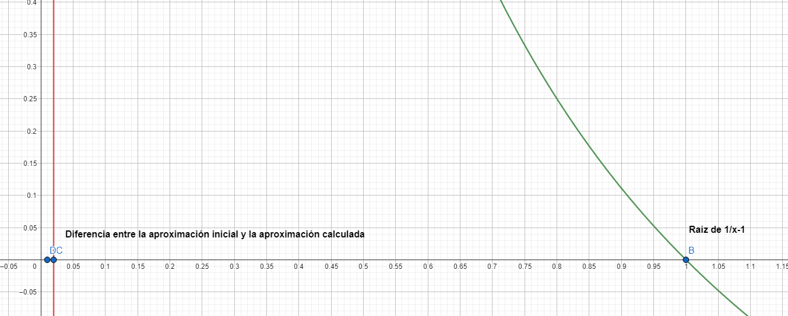

Antes de iniciar a estudiar este método, le recomiendo analizar la teoría plasmada en el [**método de la secante**](/posts/function-roots/secant), pues ambos métodos comparten un mismo principio teórico. Una vez leída la teoría, regrese aquí y siga con su estudio.

 

En el método de la secante habíamos utilizado una aproximación de la derivada f'(xr), consiguiendo así una recta secante que se aproxima a la recta tangente al punto (xr, f(xr)). Esto lo habíamos hecho bajo la suposición de que conseguir la derivada f'(x) podía llegar a ser una tarea complicada, imposible o poco conveniente para la situación. Ahora vamos a dejar esa suposición de lado y dispondremos de esta herramienta para desarrollar el método de Newton-Raphson. Usaremos la recta tangente, primero armando su expresión matemática en base a la fórmula punto-pendiente de la recta:
$$y-y_1=m(x-x_1)$$
Donde:
$$y=T(x), y_1=f(x_r), m=f'(x_r), x_1=x_r$$
$$T(x)-f(x_r)=f'(x_r)(x-x_r)$$
Observe que aquí solo necesitamos una primera aproximación xr para iniciar con el método. Vamos a buscar el cero de la recta tangente:
$$T(x_{r+1})=0 \implies -f(x_r)=f'(x_r)(x_{r+1}-x_r)$$
Despejando xr+1:
$$x_{r+1}=x_r-\frac{f(x_r)}{f'(x_r)}$$
Esta será nuestra regla de recurrencia para encontrar la raíz de la función. Este método suele ser uno de los más veloces, pero al igual que el de la secante, puede diverger de la solución. El típico caso de divergencia es cuando: f'(xr)=0 o bien cuando es un valor cercano a cero. Si la raíz de la función se encuentra cerca de un vecindario donde la derivada de la función tiende a pasar por valores cercanos a cero o pasa por puntos donde es cero, el riesgo de divergencia es mayor.

 

De hecho, también hay casos donde la velocidad de convergencia de estos métodos (secante y Newton Raphson) puede llegar a ser considerablemente lenta. Esto ocurre en regiones donde la curva de la función es muy empinada, lo que arroja valores de pendientes muy grandes tanto para las rectas secantes (método de la secante) como para las rectas tangentes (Newton Raphson). Pues, considere que en uno de los pasos con Newton-Raphson, si la magnitud del valor f'(xr) es un valor muy grande, entonces:
$$\frac{f(x_r)}{f'(x_r)} \rarr 0 \implies x_{r+1} \approx x_r$$
La nueva aproximación es practicamente igual a la aproximación anterior, por lo que apenas nos movemos, lo que significa que nos acercamos con una lentitud significativa hacia la solución real. Considere, por ejemplo, la aproximación inicial xr=0.01 para la función:
$$f(x)=\frac{1}{x}-1$$
$$f'(x)=-\frac{1}{x^2}$$
Calculamos la nueva aproximación:
$$x_{r+1}=0.01-\frac{\frac{1}{0.01}-1}{-\frac{1}{0.01^2}}=0.0199$$
En términos absolutos, solo nos hemos distanciado 0.0099 unidades de la aproximación inicial. Recordemos que la raíz real de esta función es xs=1. 

**PSEUDOCÓDIGO**
 
Paso 1: Introduzca el número xr. Si f(xr)=0 se retorna xr como solución.
 
Paso 2: INICIA BUCLE "MIENTRAS / WHILE"
 
**INICIO BUCLE**
 
**CONDICIONAL (f'(xr) = 0)** {
     
    No se puede dividir por cero. Detén el algoritmo y retorna la última aproximación que hayas calculado, si es que se ha calculado una.
     
}
 
xr+1=xr-f(xr)/f'(xr)
 
Es |f(xr+1)|< tolerancia ? Si lo es, se detiene el algoritmo y se retorna xr+1 como solución. Si no lo es, se continúa con el algoritmo.
 
xr=xr+1
 
**CIERRE BUCLE**
 
Paso 3: Se retorna la última aproximación xr+1 calculada.

 

Algunas funciones que pueden tener problemas con la divergencia o convergencia lenta en los métodos de Newton Raphson y de la secante son:
* Funciones racionales que presenten discontinuidades cerca de la región donde se encuentre la raíz.
* Funciones cuyas curvas en el gráfico se aplanan cerca de la región donde se encuentra la raíz (pendientes pequeñas).
* Funciones oscilatorias (si bien la combinación del signo de la derivada y el signo de la función es útil para saber en que dirección debemos movernos, puede ocurrir que la función oscile. Podríamos partir de un valor positivo, descender de a poco hacia cero y volver a ascender).
* Funciones cuyas curvas en el gráfico sean muy empinadas cerca de la región donde se encuentra la raíz (pendientes grandes)
