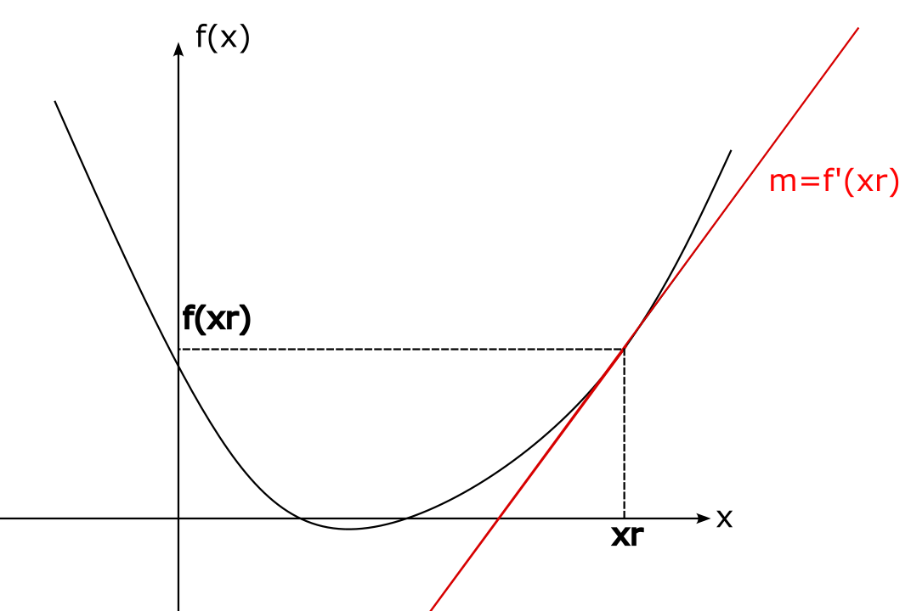
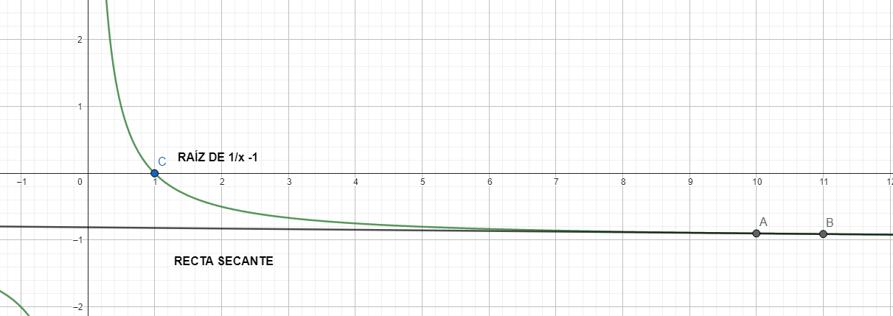

A partir de aquí, empezamos a ver métodos abiertos, por lo que dejamos de lado el teorema de valor intermedio. Ya no tenemos un intervalo donde podamos asegurar la existencia de la raíz, sino un conjunto de aproximaciones iniciales que nos sirvan para encontrar la raíz.

 

El método de la secante es similar al [**método de Newton-Raphson**](/posts/function-roots/newton-raphson), por lo que explicaremos aquí los principios de ambos métodos. Le recomiendo repasar la derivada de funciones de una variable en caso de que no tenga fresco el tema.

 

Si bien recuerda, la derivada de una función f(x) evaluada en un punto x=xr, f'(xr), es igual a la pendiente de la recta tangente a la función en el punto (xr, f(xr)). Además de ser la pendiente de la recta tangente, también es la tasa de cambio instantánea de la función en xr.

$$f'(x_r)=\lim\limits_{x \rarr x_r}\frac{f(x)-f(x_r)}{x-x_r}$$

Supóngase por un momento que la función f(x) es positiva en x=xr. Si la función es positiva, ¿en qué dirección debería moverse usted para hallar un cero? ¡En la dirección para donde decrezca la función, por supuesto! ¿Pero cómo puede predecir en qué dirección va a decrecer la función, cuando puede moverse para la derecha o para la izquierda? *Ding ding*, si no pudo responder a la pregunta, ha perdido el millón de dólares. ¡Es el signo de la derivada el que le indica para donde debe moverse! Si f(xr) es positivo y la derivada f'(xr) es positiva, tendríamos el siguiente caso como ejemplo:

La pendiente de la recta tangente es f'(xr), la cual es positiva, por ende debemos movernos hacia la izquierda de xr, en el sentido decreciente de **x** para decrecer en los valores de la función. Si f'(xr) fuera negativa, la recta tangente estaría inclinada al revés y deberíamos movernos a la derecha de xr, en el sentido creciente de **x** para decrecer en los valores de la función. Le invito a hacer usted mismo los gráficos para los cuatro casos y dictaminar en que dirección debe moverse en cada caso para hallar un cero de la función:
$$f(x_r)>0, f'(x_r)>0$$
$$f(x_r)>0, f'(x_r)<0$$
$$f(x_r)<0,f'(x_r)>0$$
$$f(x_r)<0, f'(x_r)<0$$
La combinación del signo de f(xr) y f'(xr) siempre nos dice en que dirección debemos movernos si queremos hallar una raíz. Sin embargo, la pregunta que resta es: ¿cuántas unidades nos movemos? ¿Un paso? ¿Dos pasos? ¿Ochocientos cuarenta mil pasos? Lo cierto es que no requerimos decidir arbitrariamete cuantos pasos movernos, podemos usar directamente el cero de la recta tangente para aproximarnos a la raíz de la función. Si hizo los gráficos de los anteriores cuatro casos, observe que el cero de la recta tangente siempre está en la misma dirección a la que debemos movernos para hallar un cero de la función. Usemos la fórmula punto-pendiente para hallar la ecuación de la recta tangente:
$$y-y_1=m(x-x_1)$$
Recordemos que "m" es la pendiente de la recta, entonces:
$$y=T(x), y_1=f(x_r), m=f'(x_r), x_1=x_r$$
Sin embargo, asumamos que no conocemos el valor de f'(xr), ya sea porque resulta díficil hallar la expresión de la derivada o alguna otra razón. Si usted recuerda, el valor de la derivada era:
$$f'(x_r)=\lim\limits_{x \rarr x_r}\frac{f(x)-f(x_r)}{x-x_r}$$
Aún podemos aproximar el valor de la derivada sacando el límite y utilizando diferencias finitas, tratando de que sean lo más pequeñas posibles. Como las diferencias son finitas, el valor **x** del límite asume un valor cercano a xr, llamemosle "xr+1":
$$f'(x_r) \approx \frac{f(x_{r+1})-f(x_r)}{x_{r+1}-x_r}$$
Esto no es más que la pendiente de la recta secante que pasa por los puntos (xr,f(xr)) y (xr+1, f(xr+1)) y es aproximadamente igual a la pendiente de la recta tangente. De aquí el nombre del "método de la secante". Reemplazamos y=T(x) por y=S(x):
$$y=S(x), y_1=f(x_r), m=\frac{f(x_{r+1})-f(x_r)}{x_{r+1}-x_r}, x_1=x_r$$
$$S(x)-f(x_r)=\frac{f(x_{r+1})-f(x_r)}{x_{r+1}-x_r}(x-x_r)$$
$$S(x_{r+2})=0 \implies -f(x_r)=\frac{f(x_{r+1})-f(x_r)}{x_{r+1}-x_r}(x_{r+2}-x_r)$$

Despejando xr+2:
$$x_{r+2}=x_r-f(x_r)\frac{x_{r+1}-x_r}{f(x_{r+1})-f(x_r)}$$
Esta será nuestra regla de recurrencia para el método de la secante. Fíjese que requerimos de dos aproximaciones iniciales: xr y xr+1. Por otro lado, este método tiende a ser más rápido que los anteriores dos métodos cerrados que hemos visto, es decir que puede resolver un mismo problema en menor cantidad de pasos, sin embargo, puede diverger. La divergencia del método significa que en vez de acercarse a la solución, se aleja cada vez más. Un caso típico de divergencia ocurre cuando f(xr+1)-f(xr)=0, esto resulta en una división por cero, algo imposible. También puede ocurrir cuando la diferencia no es cero, pero tiende a cero, lo que resultaría en que la magnitud de xr+2 tienda a infinito. Un ejemplo de una función típica que pueda causar este problema es la siguiente:

$$f(x)=\frac{1}{x}-1$$

La raíz de esta función es fácil de calcular a mano, es xs=1. Sin embargo, si se aplica el método de la secante utilizando como aproximaciones iniciales: xr=10 y xr+1=11, nuestra siguiente aproximación xr+2 sería:

$$x_{r+2}=10-\left(\frac{1}{10} - 1\right)\left(\frac{11-10}{\left(\frac{1}{11} - 1\right)-\left(\frac{1}{10} - 1\right)}\right)=-89$$

Un valor que se aleja considerablemente de la raíz real.

La regla para actualizar las variables en cada nuevo paso son sencillas y no se debe seguir ningún criterio específico, simplemente xr pasa a ser xr+1 y xr+1 pasa a ser xr+2:
$$x_r=x_{r+1}$$
$$x_{r+1}=x_{r+2}$$

**PSEUDOCÓDIGO**
 
Paso 1: Introduzca números xr y xr+1. Si f(xr)=0 se retorna xr como solución. Si f(xr+1)=0 se retorna xr+1 como solución.
 
Paso 2: INICIA BUCLE "MIENTRAS / WHILE"
 
**INICIO BUCLE**
 
**CONDICIONAL (Si f(xr+1)-f(xr) = 0)** {
     
    No se puede dividir por cero. Detén el algoritmo y retorna la última aproximación que hayas calculado, si es que se ha calculado una.
     
}
 
xr+2=xr-f(xr)(xr+1-xr)/(f(xr+1)-f(xr))
 
Es |f(xr+2)|< tolerancia ? Si lo es, se detiene el algoritmo y se retorna xr como solución. Si no lo es, se continúa con el algoritmo.
 
xr=xr+1
 
xr+1=xr+2
 
**CIERRE BUCLE**
 
Paso 3: Se retorna la última aproximación xr+2 calculada.

 

El [**método de Regula Falsi**](/posts/function-roots/regula-falsi) puede ser visto como un punto intermedio entre el [**método de la bisección**](/posts/function-roots/bisection) y el método de la secante.